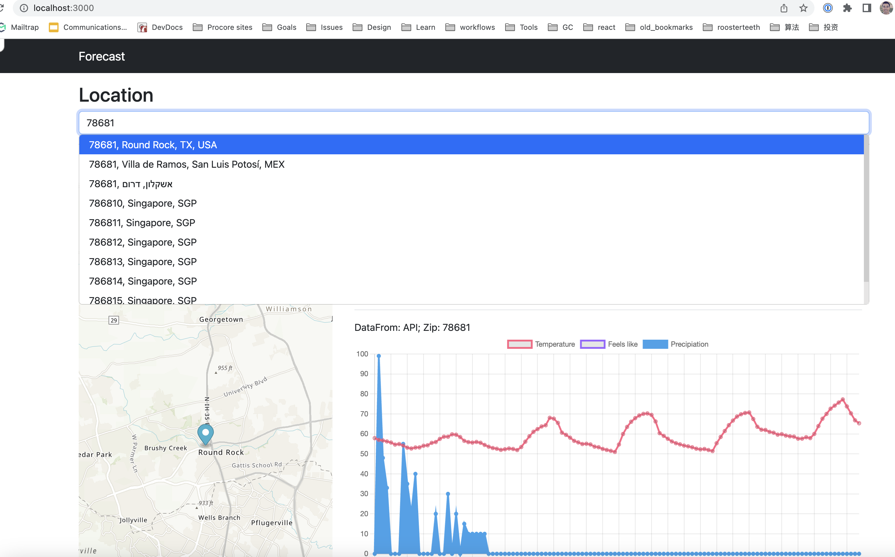
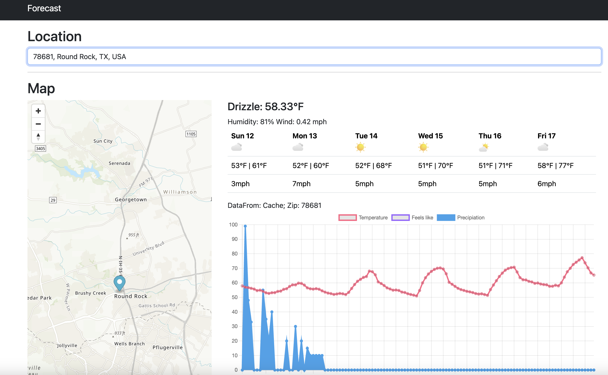
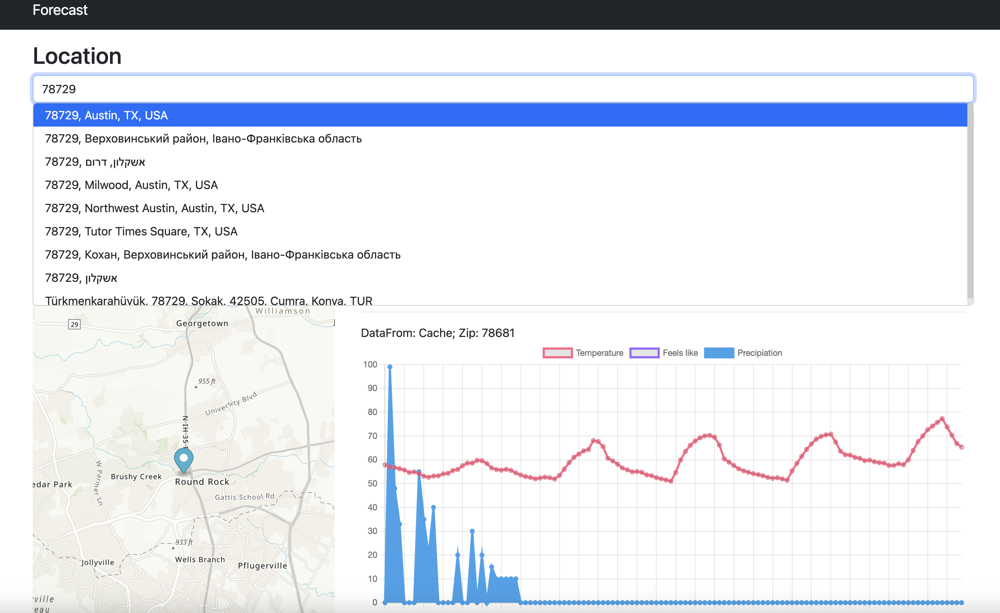
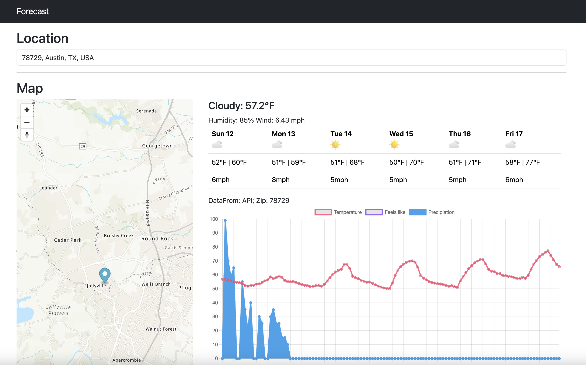

# README

This is a demo of Forecast project.


# install

## prerequisites
- ruby 2.7.7 installed
- redis installed


```
git clone https://github.com/prob-solver/forecast.git
cd forecast
bundle install
cp .env.example .env

// update .env file with your own keys

bundle exec rails s

```

## screenshots






## Requirement:
User input an address, show forecast. including temparature now, min and max etc.


1. User type in address
2. Autocomplete provide accurate addresses for user to pick (AWS Location Service provide suggestions)
3. User pick one address (a unique one)
4. Find zip code of address, if no zip code by default, then query location by latitudes and longtitude again to fetch zip code.
5. Call Forecast API to get data by zip code, cache it (Tomorrow API)
6. Presentation: Display forecast data and Map (chart.js)


# Todo
- Remember user's address selection history, easier to pick next time
- Display more weather data and icon
- Display hourly forecast